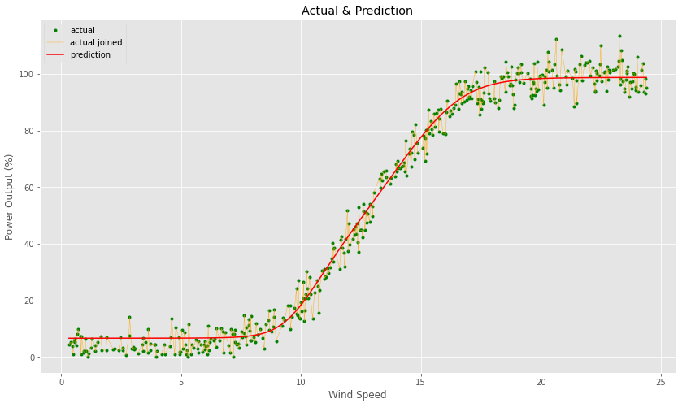
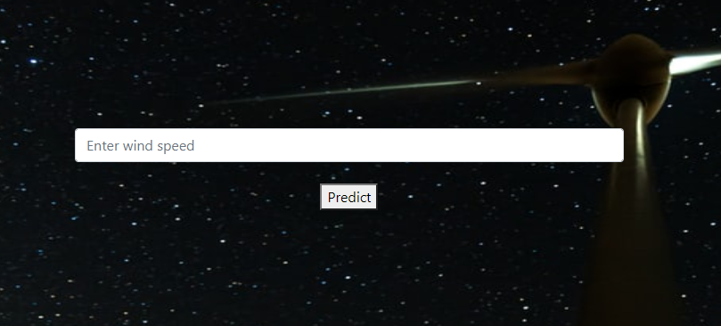
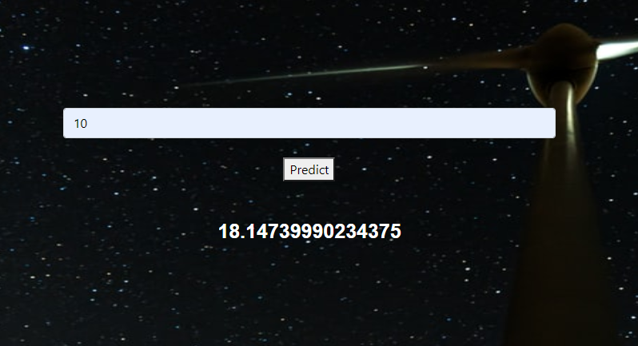

# Emerging Technology Project 2020

## Power Prediction Application
*Darragh Lally, G00220290, 4th year Computer Science student, GMIT.*

### Introduction
This repositiory contains my solution to the 2020 project for Emerging Technologies, delivered by Dr. Ian McLoughlin. The task requires me to create a model that will predict the power generated from a wind speed value provided by a user. To do this I will need to implement a number of steps:
1. Create a prediction model in jupyter notebook.
2. Create a web application that will accept a value and return a prediction.
3. Use Docker to create an image of my application and a container in which my application will run. 

To get more in-depth comments on the creation of the model in the notebook see the notebook itself.

#### Repository Contents
* misc folder:
    * Assesment spec.
    * power production data x2 - .csv and .xlsx.
* static folder:
    * index.html: Web page that displays the application.
    * Web page background image.
* .dockerignore
    * File similar to a .gitignore, which tells Docerfile what to ignore when creating the container.
* Dockerfile:
    * Used to create an image of a container within which my project will run.
* Jupyter-notebook:
    * Used to train a model that can predict a power output from a wind speed input.
* model.h5:
    * A model created from the power production .csv
* requirements.txt:
    * Used by the Dockerfile to get a list of required packages.
* web-service.py
    * A python script that runs my web application.
* General repo files
    * .gitignore - python
    * README.md
    * readmeImgs folder

### Run Jupyter-notebook
1. Clone Repository
2. Navigate to cloned folder
3. Open in command prompt (Of your choice)
4. Enter command: 
```python
jupyter-notebook
```
***Note Book opens in your browser.***

In the navigation bar select:
*Kernal*
*Restart & Run All*

It will take a few moments for the model to be created, due to the number of neurons, their activation and the number of epochs we are training the model for. Below is a screen grab of the models graph.



Accuracy loss after a wind input of 67, I believe this is due to the lack of training and training data my model has. Below are screen grabs of the web app.





### Useful Commands
#### LINUX: How to run web-service
``` bash
$ export FLASK_APP=web-service.py
$ python3 -m flask run
 * Running on http://127.0.0.1:5000/
```

#### WINDOWS: How to run web-service
``` bash
set FLASK_APP=web-service.py
python -m flask run
 * Running on http://127.0.0.1:5000/
```

#### Docker: Create image and container, run
``` bash
docker --version
docker build -t web-service
docker run --name web-service-container -d -p 5000:5000 web-service-image
 * Running on http://127.0.0.1:5000/
```

#### Docker: Delete Image
``` bash
docker container ls
    * copy imageID
docker kill imageID
docker container ls -a
docker rm imageID
```

#### References
random-app - Dr. Ian McLoughlin; GitHub: https://github.com/ianmcloughlin/random-app/blob/master/rando.py

Flask: https://www.tutorialspoint.com/flask/flask_templates.htm

Flask: https://flask.palletsprojects.com/en/1.1.x/quickstart/#apis-with-json

Docker: https://www.docker.com/resources/what-container

Docker: https://docs.docker.com/get-started/

HTML, CSS - W3Schools: https://www.w3schools.com/

Plots: https://matplotlib.org/3.3.3/api/_as_gen/matplotlib.lines.Line2D.html#matplotlib.lines.Line2D.set_linewidth

Activation Functions: https://towardsdatascience.com/activation-functions-neural-networks-1cbd9f8d91d6

Markdown Guide: https://github.com/adam-p/markdown-here/wiki/Markdown-Cheatsheet

Markdown Guide: https://guides.github.com/features/mastering-markdown/

Markdown Online Viewer: https://dillinger.io/


